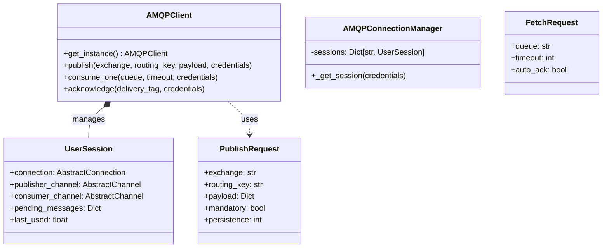
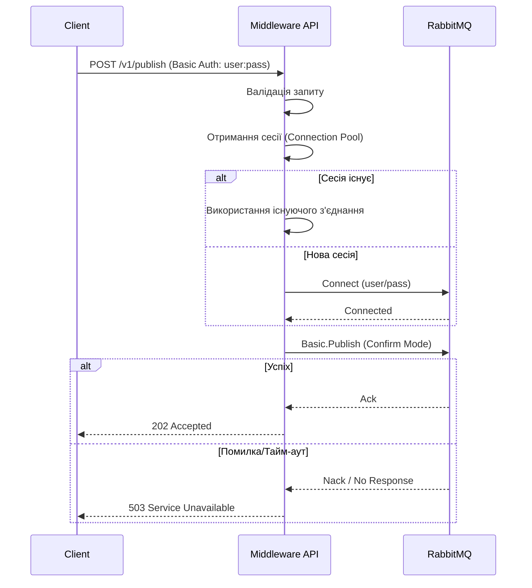

# HTTP-to-AMQP Bridge Middleware

Надійне, готове до продакшену middleware для інтеграції RabbitMQ (AMQP) з HTTP сервісами (наприклад, 1C:Enterprise).

## Огляд

Це middleware діє як надійний міст між HTTP клієнтами та RabbitMQ, забезпечуючи:
- **Публікацію (Publishing)**: HTTP POST -> RabbitMQ Exchange (Надійно)
- **Споживання (Consuming)**: HTTP POST (Long-polling) <- RabbitMQ Queue

## Можливості
- **Бриджинг протоколів**: Конвертує HTTP REST запити в AMQP повідомлення.
- **Надійність**: Використовує RabbitMQ Publisher Confirms та ручні підтвердження (acknowledgments) для гарантії доставки "At-Least-Once".
- **Управління топологією**: Автоматично налаштовує Exchanges, Queues та Dead Letter Exchanges (DLX).
- **Безпека**:
  - **HTTP Basic Authentication**: Використовує стандартний механізм аутентифікації. Middleware виступає проксі, передаючи облікові дані (username/password) безпосередньо в RabbitMQ.
  - Управління підключеннями (Connection Pooling): Автоматично створює та кешує з'єднання для кожного користувача.
  - Обмеження частоти запитів (Rate Limiting)
  - Валідація та санітизація вхідних даних (відповідно до OWASP)
- **Спостережуваність (Observability)**: Структуроване JSON логування з Correlation IDs та Prometheus метрики.
- **Валідація схеми**: Строгі Pydantic V2 моделі для надійної обробки даних.

## Встановлення та локальна розробка

### Передумови
- Python 3.11+
- [uv](https://github.com/astral-sh/uv) (рекомендовано) або pip
- Docker та Docker Compose

### Налаштування
1. Клонуйте репозиторій:
   ```bash
   git clone <repo-url>
   cd rmq_middleware
   ```

2. Встановіть залежності:
   ```bash
   uv sync
   ```

3. Запустіть юніт-тести:
   ```bash
   uv run pytest
   ```

## Розгортання (Deployment)

### Docker Compose (Рекомендовано)

1. Створіть файл `.env` (див. приклад у `.env.example`).
2. Запустіть сервіси:
   ```bash
   docker-compose up -d
   ```
3. Перевірте статус (Health check):
   ```bash
   curl http://localhost:8000/health
   ```

## Архітектура

### Діаграма класів (Class Diagram)



### Діаграма послідовності: Публікація (Sequence Diagram)



## Приклади використання (Python)

### 1. Публікація повідомлення

Middleware використовує **HTTP Basic Auth**. Ви повинні надати ім'я користувача та пароль, які зареєстровані в RabbitMQ. Middleware підключиться від імені цього користувача.

```python
import requests
from requests.auth import HTTPBasicAuth

url = "http://localhost:8000/v1/publish"
auth = HTTPBasicAuth('my_rmq_user', 'my_secret_pass')

payload = {
    "exchange": "enterprise.core",
    "routing_key": "order.created",
    "payload": {
        "order_id": 12345,
        "amount": 99.99
    },
    "persistent": True,
    "mandatory": True
}

response = requests.post(url, json=payload, auth=auth)
print(response.status_code) # 202
print(response.json())
```

### 2. Отримання повідомлення (Long-Polling)

```python
import requests
from requests.auth import HTTPBasicAuth

url = "http://localhost:8000/v1/fetch"
auth = HTTPBasicAuth('my_rmq_user', 'my_secret_pass')

payload = {
    "queue": "orders.queue",
    "timeout": 10,
    "auto_ack": False 
}

response = requests.post(url, json=payload, auth=auth)

if response.status_code == 200:
    msg = response.json()
    print("Отримано:", msg["body"])
    
    # Підтвердження обробки (Acknowledgment)
    ack_url = f"http://localhost:8000/v1/ack/{msg['delivery_tag']}"
    requests.post(ack_url, auth=auth)
    
elif response.status_code == 204:
    print("Черга порожня")
```

## Довідник API (API Reference)

| Ендпоінт | Метод | Опис | Auth |
|----------|-------|------|------|
| `/v1/publish` | POST | Публікація повідомлення | Basic |
| `/v1/fetch` | POST | Отримання повідомлення (Long-polling) | Basic |
| `/v1/ack/{tag}` | POST | Підтвердження повідомлення (Ack) | Basic |
| `/v1/reject/{tag}` | POST | Відхилення повідомлення (Reject) | Basic |
| `/health` | GET | Перевірка працездатності (Liveness) | None |
| `/ready` | GET | Перевірка готовності (Readiness) | None |

## Формат запитів до API

### 1. Публікація повідомлення (Publisher)

**Ендпоінт:** `POST /v1/publish`

Цей ендпоінт приймає JSON-об'єкт для публікації повідомлення в RabbitMQ.

#### Мінімальний приклад

```json
{
  "exchange": "edi.internal.topic",
  "routing_key": "erp.order.created.v1",
  "payload": {
    "orderId": "ORD-12345",
    "amount": 150.75,
    "currency": "UAH"
  }
}
```

#### Опис полів

| Поле | Тип | Опис | Обов'язкове | За замовчуванням |
|---|---|---|---|---|
| `exchange` | `string` | Назва обмінника (exchange) в RabbitMQ. | Так | - |
| `routing_key` | `string` | Ключ маршрутизації для направлення повідомлення. | Так | - |
| `payload` | `object` \| `string` | Тіло повідомлення. Може бути JSON-об'єктом або рядком. | Так | - |
| `mandatory` | `boolean` | Якщо `true`, брокер поверне помилку, якщо повідомлення неможливо нікуди направити. | Ні | `true` |
| `persistence` | `integer` | Режим доставки. `2` = Persistent (зберегти на диск), `1` = Transient (зберігати в пам'яті). | Ні | `2` |
| `priority` | `integer` | Пріоритет повідомлення (0-255). | Ні | `0` |
| `correlation_id` | `string` | Ідентифікатор для кореляції запитів та відповідей (корисно для трасування). | Ні | `null` |
| `message_id` | `string` | Унікальний ідентифікатор повідомлення. Може використовуватись для дедуплікації. | Ні | `null` |
| `headers` | `object` | Додаткові заголовки повідомлення (ключ-значення). | Ні | `null` |

### 2. Отримання повідомлення (Consumer)

**Ендпоінт:** `POST /v1/fetch`

Цей ендпоінт працює в режимі long-polling, очікуючи на повідомлення з вказаної черги.

#### Приклад запиту

```json
{
  "queue": "q.erp_central.inbox",
  "timeout": 15,
  "auto_ack": false
}
```

## Налаштування (Configuration)

Дивіться `.env.example` для детальної конфігурації. Основні змінні:
- `RABBITMQ_URL`: Рядок підключення AMQP (використовується як системний для перевірки здоров'я).
- `RABBITMQ_PREFETCH_COUNT`: Налаштування QoS.
- **Примітка:** `API_KEY` більше не використовується. Аутентифікація відбувається через Basic Auth заголовки запиту.

## Вирішення проблем (Troubleshooting)

Для детальних інструкцій з експлуатації, моніторингу та обробки збоїв, дивіться [Керівництво Оператора](docs/operators_guide.md).